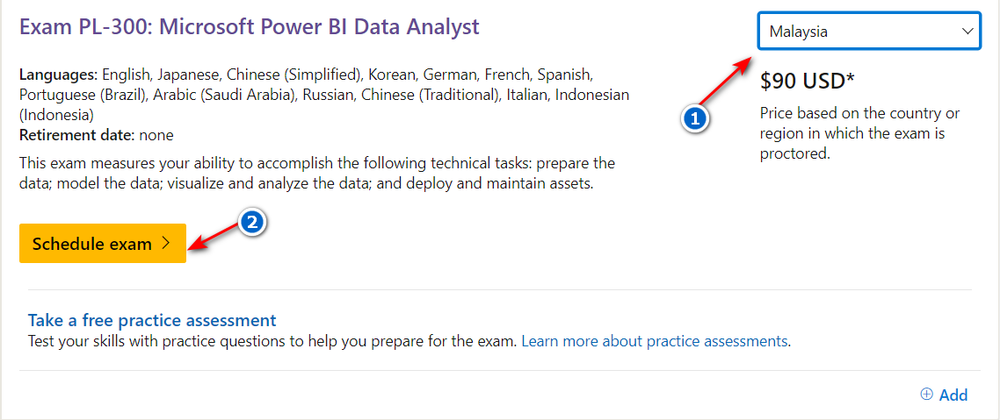
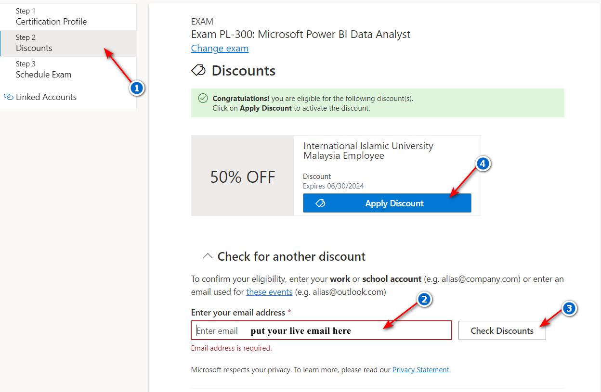

## Web Based Study Resources

1. **Examtopics (250 Ques)**\
https://www.examtopics.com/exams/microsoft/pl-300/

2. **ITexams (254 Ques)**\
https://www.itexams.com/info/PL-300

3. **Passnexam (360 Ques)**\
https://www.passnexam.com/microsoft/pl-300

## Link to Exam Registration

https://learn.microsoft.com/en-us/credentials/certifications/exams/pl-300/ \\

\\

